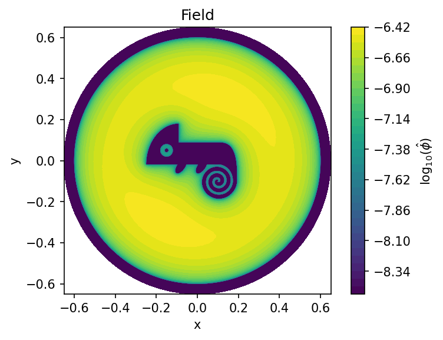

# SELCIE

Some modified gravity models introduce new scalar fields that couple to matter. Such fields would mediate a so called 'fifth force' which could be measured to confirm the existence of the field. So far, no fifth forces have been detected. Therefore, for a scalar field to affect large scale cosmological evolution and still satisfy our constraints from local measurements (solar system/laboratory) the field requires a screening mechanism. Examples include the chameleon and symmetron models. The problem with models of this kind is that the nonlinearites introduced to produce these screening mechanisms causes the equations of motion of the fields to become nonlinear, and so analytic solutions only exist for highly-symmetric cases.

SELCIE (Screening Equations Linearly Constructed and Iteratively Evaluated) is a software package that provides the user with tools to investigate the chameleon model. The code provides the user with tools to construct user defined meshes by utilising the GMSH mesh generation software. These tools include constructing shapes whose boundaies are defined by some function or by constructing it out of basis shapes such as circles, cones and cylinders. The mesh can also be seperated into subdomains, each of which having its own refinement parameters. These meshes can then be converted into a format that is compatible with the finite element software FEniCS. SELCIE uses FEniCS with a nonlinear solving method (Picard or Newton method) to solve the chameleon equation of motion for some parameters and density distrubution. These density distrubutions are constructed by having the density profile of each subdomain being set by a user defined function. This allows for extremely customisable setups that are easy to implement.

Our hope is that this software will allow researchers to easily test what the chameleon field profile would be in their system of interest, as to lead to further constraining of the model or a possible detection in the future.

In future versions of SELCIE we plan to generalize the methodology so that the user can input other screened scalar field models. The option to allow the field to evolve in time to a dynamical system is also planned, as currently the software only works for static systems.

## Example Plot


## Requirements
  - python 3.8
  - fenics 2019.1.0
  - meshio 4.3.8
  - gmsh 4.8.3
  - matplotlib
  - astropy
  - numpy
  - scipy

## Citation
If you use SELCIE in your research please include the following citation:
```
@article{Briddon:2021etm,
    author = "Briddon, Chad and Burrage, Clare and Moss, Adam and Tamosiunas, Andrius",
    title = "{SELCIE: A tool for investigating the chameleon field of arbitrary sources}",
    eprint = "2110.11917",
    archivePrefix = "arXiv",
    primaryClass = "gr-qc",
    month = "10",
    year = "2021"
}
```
